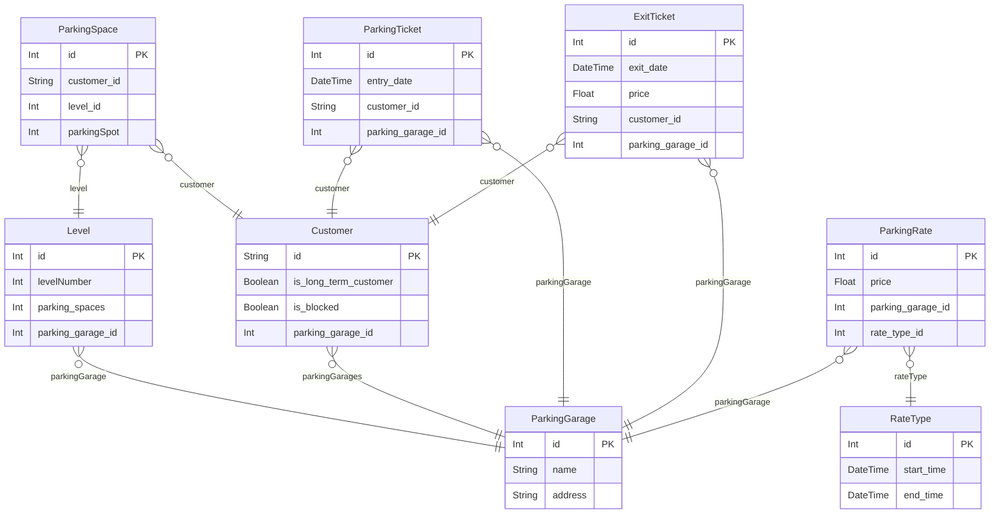

```mermaid
erDiagram

  ParkingGarage {
    Int id PK 
    String name  
    String address  
    }
  

  Level {
    Int id PK 
    Int levelNumber  
    Int parking_spaces  
    Int parking_garage_id  
    }
  

  ParkingSpace {
    Int id PK 
    String customer_id  
    Int level_id  
    Int parkingSpot  
    }
  

  Customer {
    String id PK 
    Boolean is_long_term_customer  
    Boolean is_blocked  
    Int parking_garage_id  
    }
  

  ParkingTicket {
    Int id PK 
    DateTime entry_date  
    String customer_id  
    Int parking_garage_id  
    }
  

  ExitTicket {
    Int id PK 
    DateTime exit_date  
    Float price  
    String customer_id  
    Int parking_garage_id  
    }
  

  ParkingRate {
    Int id PK 
    Float price  
    Int parking_garage_id  
    Int rate_type_id  
    }
  

  RateType {
    Int id PK 
    DateTime start_time  
    DateTime end_time  
    }
  
    Level o{--|| ParkingGarage : "parkingGarage"
    ParkingSpace o{--|| Customer : "customer"
    ParkingSpace o{--|| Level : "level"
    Customer o{--|| ParkingGarage : "parkingGarages"
    ParkingTicket o{--|| Customer : "customer"
    ParkingTicket o{--|| ParkingGarage : "parkingGarage"
    ExitTicket o{--|| Customer : "customer"
    ExitTicket o{--|| ParkingGarage : "parkingGarage"
    ParkingRate o{--|| ParkingGarage : "parkingGarage"
    ParkingRate o{--|| RateType : "rateType"
```
