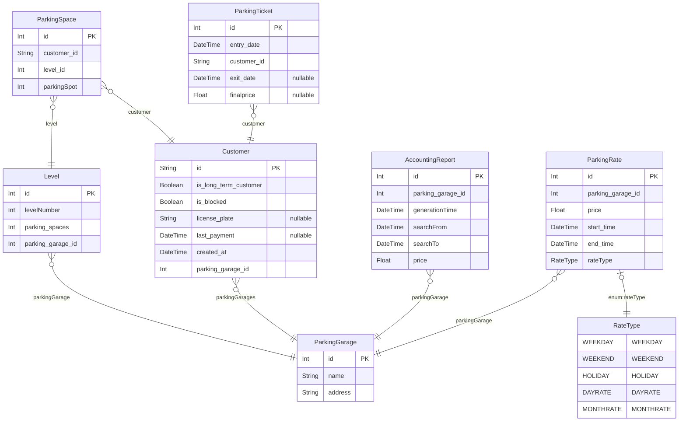

```mermaid
erDiagram

        RateType {
            WEEKDAY WEEKDAY
WEEKEND WEEKEND
HOLIDAY HOLIDAY
DAYRATE DAYRATE
MONTHRATE MONTHRATE
        }
    
  ParkingGarage {
    Int id PK 
    String name  
    String address  
    }
  

  Level {
    Int id PK 
    Int levelNumber  
    Int parking_spaces  
    Int parking_garage_id  
    }
  

  ParkingSpace {
    Int id PK 
    String customer_id  
    Int level_id  
    Int parkingSpot  
    }
  

  Customer {
    String id PK 
    Boolean is_long_term_customer  
    Boolean is_blocked  
    String license_plate  "nullable"
    DateTime last_payment  "nullable"
    DateTime created_at  
    Int parking_garage_id  
    }
  

  AccountingReport {
    Int id PK 
    Int parking_garage_id  
    DateTime generationTime  
    DateTime searchFrom  
    DateTime searchTo  
    Float price  
    }
  

  ParkingTicket {
    Int id PK 
    DateTime entry_date  
    String customer_id  
    DateTime exit_date  "nullable"
    Float finalprice  "nullable"
    }
  

  ParkingRate {
    Int id PK 
    Int parking_garage_id  
    Float price  
    DateTime start_time  
    DateTime end_time  
    RateType rateType  
    }
  
    Level o{--|| ParkingGarage : "parkingGarage"
    ParkingSpace o{--|| Customer : "customer"
    ParkingSpace o{--|| Level : "level"
    Customer o{--|| ParkingGarage : "parkingGarages"
    AccountingReport o{--|| ParkingGarage : "parkingGarage"
    ParkingTicket o{--|| Customer : "customer"
    ParkingRate o{--|| ParkingGarage : "parkingGarage"
    ParkingRate o|--|| RateType : "enum:rateType"
```
