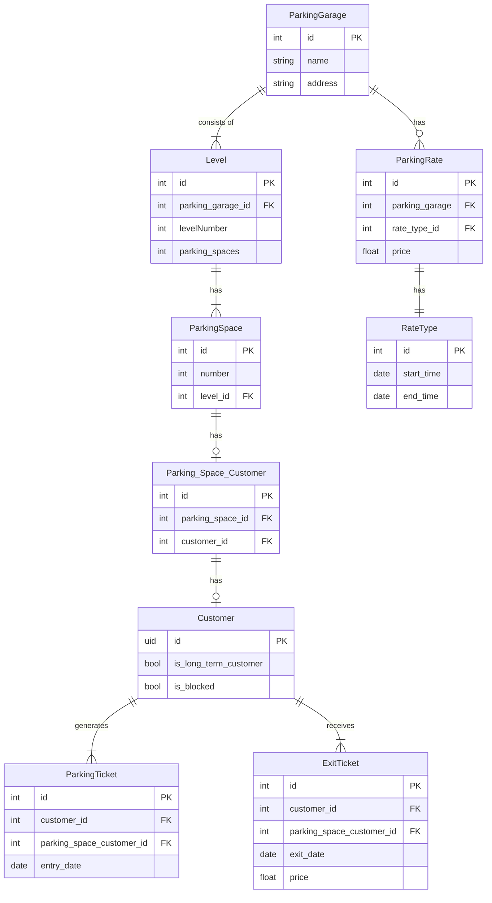

```mermaid
erDiagram
  ParkingGarage ||--|{ Level : "consists of"
  Level ||--|{ ParkingSpace : "has"
  Customer ||--|{ ParkingTicket : "generates"
  Customer ||--|{ ExitTicket : "receives"
  ParkingGarage ||--o{ ParkingRate : "has"
  ParkingSpace || -- o| Parking_Space_Customer : "has"
  Parking_Space_Customer || -- o| Customer : "has"
  ParkingRate || -- || RateType : "has"
  ParkingGarage {
    int id PK
    string name
    string address
  }
  Level {
    int id PK
    int parking_garage_id FK
    int levelNumber
    int parking_spaces
  }
  ParkingSpace {
    int id PK
    int number
    int level_id FK
  }
  Parking_Space_Customer {
    int id PK
    int parking_space_id FK
    int customer_id FK
  }
  Customer {
    uid id PK
    bool is_long_term_customer
    bool is_blocked
  }
  ParkingTicket {
    int id PK
    int customer_id FK
    int parking_space_customer_id FK
    date entry_date
  }
  ExitTicket {
    int id PK
    int customer_id FK
    int parking_space_customer_id FK
    date exit_date
    float price
  }
  ParkingRate {
    int id PK
    int parking_garage FK
    int rate_type_id FK
    float price
  }
  RateType {
    int id PK
    date start_time
    date end_time
  }

```
