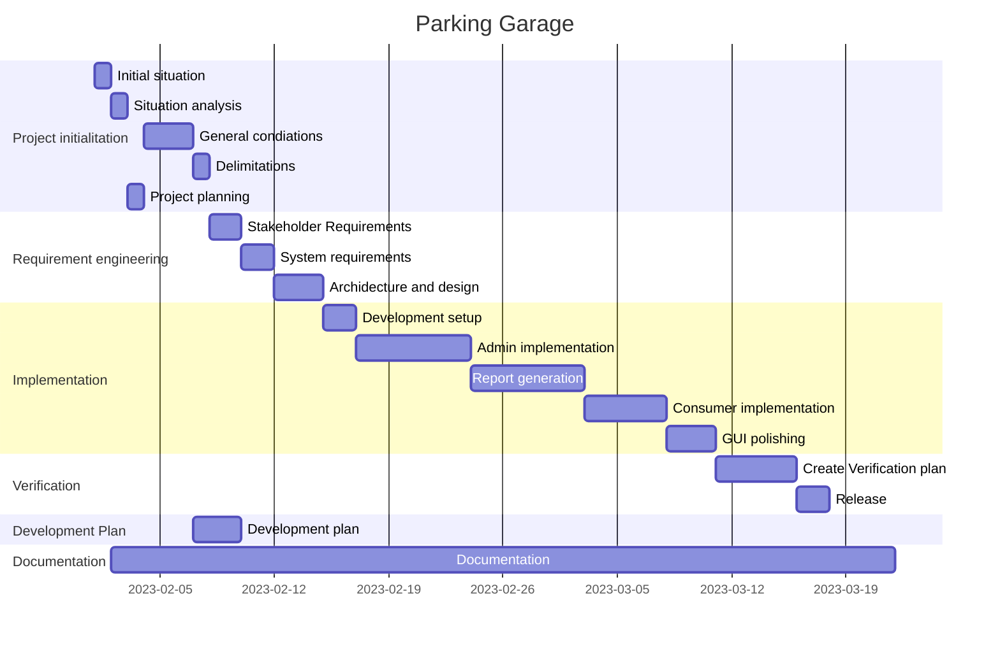

```mermaid
gantt
    title Parking Garage
    dateFormat  YYYY-MM-DD

    section Project initialitation    
    Initial situation :a1, 2023-02-01, 1d
    Situation analysis :a2,after a1, 1d
    General condiations :a3,after a5, 3d
    Delimitations :a4,after a3,1d
    Project planning :a5, after a2,1d
    section Requirement engineering
    Stakeholder Requirements :s1,after a4,2d
    System requirements  :s2,after s1, 2d
    Archidecture and design :s3,after s2, 3d
    section Implementation
    Development setup :imp1, after s3,2d
    Admin implementation :imp2, after imp1, 7d
    Report generation :imp3, after imp2, 7d
    Consumer implementation :imp4,after imp3, 5d
    GUI polishing :imp5, after imp4,3d
    section Verification
    Create Verification plan :v1, after imp5,5d
    Release :v2, after v1, 2d

    section Development Plan
    Development plan :dp1, after a3,3d
    section Documentation
    Documentation :doc, 2023-02-02, 2023-03-22 
```