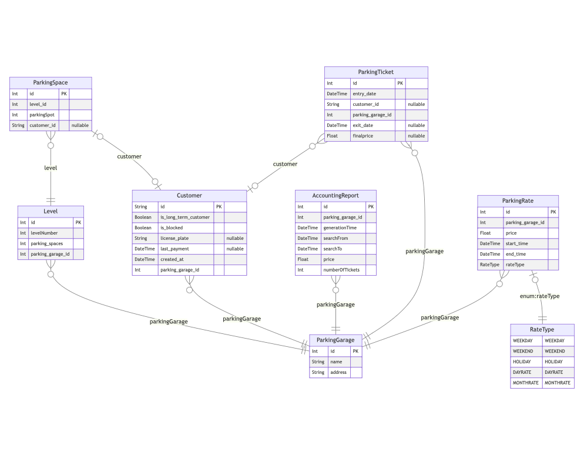

# Project summery

# Project initialization

## Initial situation

The company ParkinTown currently manages five multi-storey parking lots at different locations on behalf of several customers. The IT system used for this purpose was developed by a former employee who carries out the necessary maintenance work on a contract basis. The system is getting on in years and will have to be replaced in the near future in view of the company's planned expansion plans.
The managing director of ParkinTown has evaluated several IT solutions for the management of parking garages, but considers them all too complicated. He prefers a simple solution tailored to ParkinTown's needs. He is aware of the risks involved in developing it himself and therefore, before placing the order for the development of the entire application, he wants to have a prototype developed that simulates the operation of the parking garages.
Based on the information in this document, a specification for the prototype must first be created. The information in this document must be checked for completeness and supplemented if necessary. Then a prototype of the IT system must be built on the basis of the specifications.

## Situation analysis

The current software is already old and becoming harder to maintain. ParkingTown does not have the necessary development capabilities and is therefore searching for a external company that handles the development, maintenance and hosting of the new Software.

### Product situation

The parking garage manager from ParkingTown is a tool that supports the companies employee in their daily tasks involving the management of parking garages on behalf of their clients.

The new Software should be tailored to the processes of ParkingTown and support the employees in their daily tasks. 

ParkinTown is a company that manages multiple parking lots for various clients. Currently, the company uses an IT system that was developed by a former employee and requires maintenance work to keep it functioning. However, the system is outdated and needs to be replaced to accommodate the company's future expansion plans.

The managing director of ParkinTown has evaluated several IT solutions but has found them to be too complicated. Therefore, he desires a simple solution that is tailored to the company's specific needs. However, he is aware of the risks involved in developing an IT system in-house and wants to have a prototype developed to simulate the operation of the parking garages before placing an order for the development of the entire application.

The prototype must be developed based on a comprehensive specification that needs to be created. The specification must take into account all the requirements and operational needs of the parking garages managed by ParkinTown. It must also consider the different locations and customers of the company.

The prototype should be a functional system that simulates the operation of the parking garages. It should have all the necessary features and functionalities to manage the parking garages effectively. Additionally, it should be user-friendly and easy to use by the company's employees and customers.

The success of the prototype will depend on how well it meets the requirements of the company and its customers. It must be able to handle the volume of parking transactions effectively, and it should also be reliable and secure.

Overall, the development of a prototype for the IT system used in managing the parking garages is a critical step towards the success of ParkinTown's expansion plans. It will help the company to identify any gaps in the current system and ensure that the new system meets all the requirements of the company and its customers.

### Competitive situation

In the parking garage management industry, there are several IT solutions available that offer similar services to ParkinTown. Some of ParkinTown's competitors include:

1. TIBA Parking Systems - TIBA Parking Systems is a global leader in parking solutions. They offer a comprehensive suite of parking solutions that include hardware, software, and services. TIBA's parking management system is highly customizable and can be tailored to meet the specific needs of each client. [@tibaparking]

2. Skidata - Skidata is another major player in the parking garage management industry. They offer a range of parking solutions, including software, hardware, and services. Skidata's solutions are designed to be highly efficient and can handle high volumes of parking transactions.
   
3. Parkmobile - Parkmobile is a mobile parking solution that allows customers to pay for parking using their mobile devices. The company's solution is highly convenient for customers and can be integrated with other parking management systems.

4. FlashParking - FlashParking is a cloud-based parking management solution that offers a range of features, including real-time parking availability, revenue management, and customer insights. FlashParking's solution is designed to be highly scalable and can be used by parking garages of all sizes.
Compared to these competitors, ParkinTown's current IT system is outdated and lacks some of the advanced features offered by these companies. However, ParkinTown's managing director believes that a simple and tailored solution is better suited to the company's needs.

Therefore, the success of ParkinTown's new IT system will depend on how well it meets the specific needs of the company and its customers. ParkinTown may have an advantage over its competitors in terms of the personalized service it can offer to its customers. Additionally, if the new system is user-friendly and easy to use, it may help ParkinTown differentiate itself from its competitors and attract more customers.

### Sales situation

## General conditions

ParkinTown requires a new parking garage management tool. 

### Process-related general conditions

1. Project Management: A project manager should be appointed to oversee the development of the new IT system for ParkinTown. The project manager should be responsible for ensuring that the project is completed on time, within budget, and to the required quality standards.
2. Stakeholder Management: All stakeholders, including the managing director of ParkinTown and the customers should be involved in the development process. Their input should be sought throughout the project to ensure that their needs are met.
3. Requirements Engineering: All requirements for the new IT system should be gathered and documented in detail before the development process begins. This will help ensure that the end product meets the desired functionality.
4. Design: A detailed design specification should be created based on the requirements gathered in the previous step. This design should include all aspects of the system, including user interfaces, database design, and system architecture.
5. Quality Assurance: A quality assurance process should be put in place to ensure that the new IT system is of high quality and meets the required standards. This should include testing and validation of the system to ensure that it works as intended.
6. Documentation: All aspects of the development process, including design decisions, testing results, and system specifications, should be documented. This will allow for future maintenance and updates to be carried out more easily.
7. Training and Support: Training and support should be provided to all users of the new IT system to ensure that they are able to use it effectively. This should include user manuals and training sessions.
8. Data Privacy and Security: The new IT system should be designed with data privacy and security in mind. Measures should be put in place to ensure that customer data is protected and that the system is secure from external threats. This may include encryption of sensitive data and regular security updates.

### Product-related general conditions

| ID | Trace From | Description |
|----|------------|-------------|
| GCR-101  | Requirements | The IT system must allow for flexible configuration of the parking garages, including the number of floors and parking spaces per floor. The system should also enable customization of parking rates and tariffs, which may vary depending on the time of day and day of the week. |
| GCR-102  | Requirements | Each parking garage should have one entrance and one exit barrier. The system must be able to generate digital parking tickets for occasional users, which include the date and time of entry as well as the assigned parking space. Permanent tenants should enter a unique personal code at the entrance barrier, and their tickets should be validated before exit. All entry and exit times must be logged for billing and evaluation purposes. |
| GCR-103  | Requirements | The IT system must support two categories of customers, casual users and permanent tenants. Permanent tenants should be assigned a fixed parking space and pay a monthly rent. If the rent is not paid on time, the customer should be blocked until payment is made. The system should also ensure a balanced distribution of parking spaces for occasional users. |
| GCR-104  | Requirements | The application should offer a graphical representation of the different floors per parking garage, showing the free and occupied parking spaces as well as those of the permanent tenants. The system should be able to generate reports and evaluations per parking garage and customer category over a defined time period at any time. The turnover of each parking lot should be calculated and displayed for a given month and annually, with individual months shown separately. |
| GCR-105  | Requirements | The amount owed by occasional users should be calculated based on the length of stay and the applicable parking tariff. The system should automatically switch to a daily flat rate for stays longer than 24 hours, and the full amount should be charged for the elapsed days. After payment, a digital exit ticket should be issued to the customer. |

## Delimitations

1. Geographic scope: The system will be designed to meet the parking management needs of a single municipality or town, rather than multiple locations or regions.
2. Language and cultural context: The system will be developed in a specific language and cultural context, which may not be applicable or easily adaptable to other contexts or languages.
3. Hardware and software limitations: The system will be designed to operate on specific hardware and software platforms, and may not be compatible with other systems or technologies.
4. Timeframe: The project will focus on the development and implementation of the IT system, rather than the long-term maintenance or evolution of the system over time.
5. Budget constraints: The system will be designed to meet specific budgetary constraints, which may limit the scope or functionality of the system.
6. Parking garage configurations: The system will be designed to support a specific range of parking garage configurations, and may not be easily adaptable to other configurations or designs.
7. User categories: The system will be designed to support two specific categories of users (casual users and permanent tenants), and may not be applicable to other categories of users.
8. Parking rates and tariffs: The system will be designed to support a specific range of parking rates and tariffs, which may not be applicable or adaptable to other contexts or markets.
9. Algorithm for parking space allocation: The system will use a specific algorithm to allocate parking spaces for occasional users, which may not be easily adaptable to other algorithms or methods of allocation.

## Stakeholder analysis

### Stakholders

| ID| Stakeholder| Description|
|------------|------------|-------------|
| CUPT| Customers (Casual Users and Permanent Tenants)| They are the primary stakeholders who will use the parking system and benefit from its features. Casual users will expect a hassle-free parking experience with transparent billing and adequate parking space availability, while permanent tenants will expect a personalized parking solution with timely billing and automated payment options.|
| PGO | Parking Garage Owners| They are the ones who will own and operate the parking garages. They will expect a reliable IT system that can cater to the diverse needs of their customers and offer timely billing and revenue generation. They may also expect a user-friendly interface to manage parking space allocation and rates.|
| IDSA | IT Developers and System Administrators| They are responsible for developing and maintaining the parking system. They will expect a clear understanding of the stakeholders' requirements, access to the necessary resources, and a flexible system architecture to accommodate future changes in the parking industry.|
| MAR | Municipal Authorities and Regulators| They are responsible for ensuring compliance with local regulations, safety standards, and environmental norms. They will expect the parking system to follow the applicable rules and regulations, maintain accurate records of parking transactions, and provide transparent billing information to customers and regulators.|
| FPSP | Financial Institutions and Payment Service Providers | They are responsible for processing payments and ensuring the security of financial transactions. They will expect the parking system to integrate with their payment processing platforms, offer secure payment options, and maintain accurate records of financial transactions.|

# Concept

## Context diagram

## Detailed requirements for the new system

## Use Case Descriptions

## Sequence diagram

## Class diagram

## Database modeling

### ERD

## System architecture

# Implementation

## Development environment

# Conclusion

# Glossary

# References
