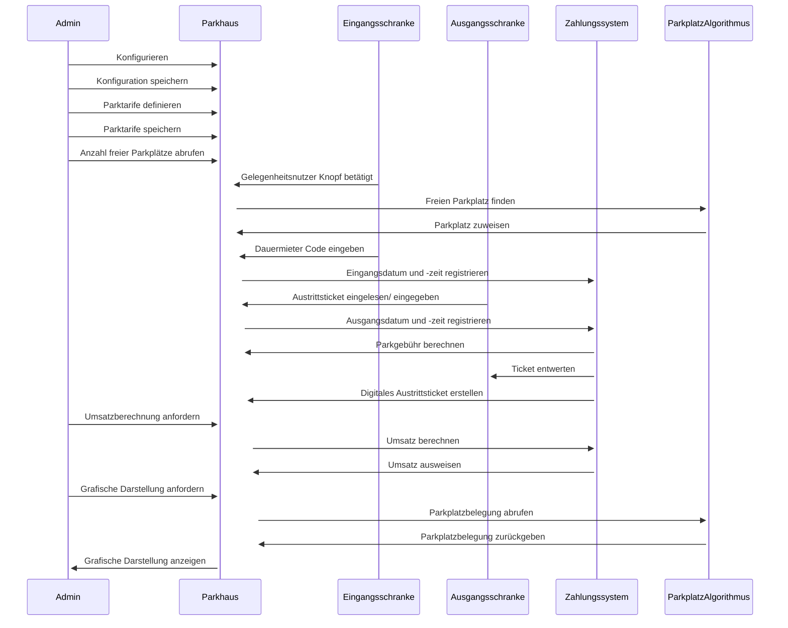

```mermaid
sequenceDiagram
  participant Admin
  participant Parkhaus
  participant Eingangsschranke
  participant Ausgangsschranke
  participant Zahlungssystem
  participant ParkplatzAlgorithmus

  Admin->>+Parkhaus: Konfigurieren
  Admin->>+Parkhaus: Konfiguration speichern
  Admin->>+Parkhaus: Parktarife definieren
  Admin->>+Parkhaus: Parktarife speichern
  Admin->>+Parkhaus: Anzahl freier Parkplätze abrufen

  Eingangsschranke->>+Parkhaus: Gelegenheitsnutzer Knopf betätigt
  Parkhaus->>+ParkplatzAlgorithmus: Freien Parkplatz finden
  ParkplatzAlgorithmus->>+Parkhaus: Parkplatz zuweisen
  Eingangsschranke->>+Parkhaus: Dauermieter Code eingeben
  Parkhaus->>+Zahlungssystem: Eingangsdatum und -zeit registrieren

  Ausgangsschranke->>+Parkhaus: Austrittsticket eingelesen/ eingegeben
  Parkhaus->>+Zahlungssystem: Ausgangsdatum und -zeit registrieren
  Zahlungssystem->>+Parkhaus: Parkgebühr berechnen
  Zahlungssystem->>+Ausgangsschranke: Ticket entwerten
  Zahlungssystem->>+Parkhaus: Digitales Austrittsticket erstellen

  Admin->>+Parkhaus: Umsatzberechnung anfordern
  Parkhaus->>+Zahlungssystem: Umsatz berechnen
  Zahlungssystem->>+Parkhaus: Umsatz ausweisen
  Admin->>+Parkhaus: Grafische Darstellung anfordern
  Parkhaus->>+ParkplatzAlgorithmus: Parkplatzbelegung abrufen
  ParkplatzAlgorithmus->>+Parkhaus: Parkplatzbelegung zurückgeben
  Parkhaus->>+Admin: Grafische Darstellung anzeigen

```
